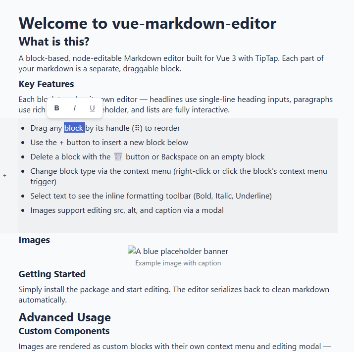

<picture>
  <source media="(prefers-color-scheme: dark)" srcset="docs/img/editor-1.png">
  
</picture>

# @grandaniel/vue-markdown-editor

> A block-based, Notion-like Markdown editor for Vue 3. UI-first. Powered by [TipTap](https://tiptap.dev/).

**@grandaniel/vue-markdown-editor** is a rich block-editing experience where every Markdown element — headlines, paragraphs, lists, images — is its own independently editable, draggable block. Built for content-first workflows: write, reorder, and format with keyboard shortcuts and an always-visible drag handle.

Images are first-class citizens: paste an image to auto-upload, then edit its **src**, **alt text**, and **caption** in a dedicated modal. The editor serializes back to clean Markdown automatically.

---

## Table of Contents

- [Who uses it](#who-uses-it)
- [Installation](#installation)
- [Quick Start](#quick-start)
- [Keyboard Shortcuts](#keyboard-shortcuts)
- [Image Upload](#image-upload)
- [API Reference](#api-reference)
- [Custom Styling](#custom-styling)
- [Supply Chain Security](#supply-chain-security)
- [Contributing](#contributing)
- [License](#license)

---

## Who uses it

| Project | How |
|---|---|
| **[heartbeat.systems](https://heartbeat.systems)** | Admin utility — content editors manage help articles, release notes, and in-app documentation through the block editor. |
| **[markdownstud.io](https://markdownstud.io)** | AI writing assistant — the editor serves as the primary composition surface where users draft, review, and polish AI-generated content. |

---

## Installation

```bash
npm install @grandaniel/vue-markdown-editor
```

> **Peer dependency:** Vue `^3.5.0`  
> **Node:** `>=22`  

Import the component **and** the stylesheet:

```ts
import { MarkdownEditor, useMarkdownEditor } from "@grandaniel/vue-markdown-editor";
import "@grandaniel/vue-markdown-editor/style.css";
```

---

## Quick Start

The editor is driven by a composable: `useMarkdownEditor()` creates the reactive state, and `<MarkdownEditor>` renders it.

```vue
<script setup lang="ts">
import { ref } from "vue";
import {
  MarkdownEditor,
  useMarkdownEditor,
  type MarkdownAstNode,
} from "@grandaniel/vue-markdown-editor";
import "@grandaniel/vue-markdown-editor/style.css";

const editor = useMarkdownEditor("# Hello, world!\n\nStart writing here…");
const focusedNode = ref<MarkdownAstNode | null>(null);
</script>

<template>
  <MarkdownEditor
    :editor="editor"
    v-model:focused-node="focusedNode"
  />
</template>
```

### Reading the output

The composable keeps the raw Markdown in sync automatically. Read it at any time:

```ts
console.log(editor.markdownContent.value);
// "# Hello, world!\n\nStart writing here…"
```

You can also **programmatically set** the content:

```ts
editor.markdownContent.value = "## New heading\n\nFresh content.";
```

---

## Keyboard Shortcuts

| Key | Action |
|---|---|
| <kbd>↑</kbd> / <kbd>↓</kbd> | Move focus between blocks |
| <kbd>Enter</kbd> | Split current block → insert new paragraph below |
| <kbd>Backspace</kbd> (empty block) | Delete the block, focus moves up |
| <kbd>Delete</kbd> (empty block) | Delete the block, focus stays at same index |
| Click blank area | Append a new empty paragraph at the bottom |

### Auto type‑detection

Type `# `, `## `, or `### ` at the start of a paragraph and the block auto‑converts to the matching heading level.

---

## Image Upload

Images are first-class blocks with **src**, **alt text**, and **caption** fields. Right‑click any image → **Edit Attributes** to open the editing modal.

### Paste‑to‑upload

Pass an `imageUploadFunction` prop — any pasted image (`Ctrl+V`) from the clipboard will be sent through your upload handler and inserted as a new image block:

```vue
<script setup lang="ts">
async function uploadImage(file: File): Promise<string> {
  const formData = new FormData();
  formData.append("image", file);

  const res = await fetch("/api/upload", { method: "POST", body: formData });
  const { url } = await res.json();
  return url;
}
</script>

<template>
  <MarkdownEditor
    :editor="editor"
    :image-upload-function="uploadImage"
  />
</template>
```

The serialized Markdown uses a custom block syntax for images:

```markdown
"""MarkdownModuleImage
src: https://example.com/photo.jpg
alt: A scenic mountain view
caption: Photo taken during the 2026 summit
"""
```

> **Note:** `imageUploadFunction` is optional. Without it, pasted images from the clipboard are ignored.

---

## API Reference

### `useMarkdownEditor(initialContent?: string)`

Returns a reactive editor instance:

| Member | Type | Description |
|---|---|---|
| `markdownContent` | `Ref<string>` | Reactive raw Markdown. Read to serialize, write to load content. |
| `markdownNodes` | `Ref<MarkdownAstNode[]>` | Reactive array of AST nodes. |
| `deleteNode(index)` | `(index: number) => void` | Remove the node at `index`. |
| `addBlankNode(index?)` | `(index?: number) => number` | Insert an empty paragraph at `index` (or end). Returns the new index. |
| `addNodeWithType(index, type, content?)` | `(index: number, type: MarkdownNodeType, content?: string) => number` | Insert a typed node. Returns the new index. |
| `replaceNodeType(node, newType)` | `(node: MarkdownAstNode, type: MarkdownNodeType) => { newNode, index } \| null` | Convert between block types (e.g. paragraph → heading). |
| `moveNode(from, to)` | `(fromIndex: number, toIndex: number) => void` | Programmatically reorder a block. |

### `MarkdownEditor` props

| Prop | Type | Required | Description |
|---|---|---|---|
| `editor` | `MarkdownEditorInstance` | ✓ | Instance from `useMarkdownEditor()`. |
| `focusedNode` | `MarkdownAstNode \| null` | — | For `v-model:focused-node` tracking. |
| `imageUploadFunction` | `(file: File) => Promise<string>` | — | Async callback for paste‑to‑upload. |

### `MarkdownEditor` emits

| Event | Payload | Description |
|---|---|---|
| `update:focused-node` | `MarkdownAstNode \| null` | Fires when focus moves to a new block. |

### `MarkdownEditor` slots

| Slot | Description |
|---|---|
| `after-controls` | Injected inside every block, after the drag‑handle / add / delete controls. |

### Exported types & utilities

| Export | Kind |
|---|---|
| `MarkdownEditorInstance` | Type — return type of `useMarkdownEditor()`. |
| `MarkdownAstNode` | Class — AST node with `id`, `type`, `componentState`, `editingState`. |
| `MarkdownAstNodeType` | Enum — `PARAGRAPH`, `HEADLINE1`, `HEADLINE2`, `HEADLINE3`, `IMAGE`, `LIST`. |
| `ImageNode` | Type alias — `MarkdownAstNode<MarkdownModuleImageState>`. |
| `TextNode` | Type alias — `MarkdownAstNode<MarkdownModuleTextState>`. |
| `TextishNodeType` | Type — union of `PARAGRAPH \| HEADLINE1 \| HEADLINE2 \| HEADLINE3 \| LIST`. |
| `isTextNodeState(node)` | Type guard for text‑based nodes. |
| `isTextNodeType(type)` | Type guard for text‑based node types. |

---

## Custom Styling

All components use scoped SCSS. To override styles, use **global CSS** with higher specificity, or Vue's `:deep()` combinator from a parent component.

### CSS class reference

| Class | Applies to |
|---|---|
| `.markdown-editor` | Root editor container |
| `.markdown-editor-module` | Individual block wrapper — `.is-focused` when active |
| `.markdown-editor-module-controls` | Left control bar (drag handle + add/delete buttons) |
| `.markdown-editor-module-content` | Content area inside a block |
| `.markdown-editor-module-content-focused` | Content area when the block is focused |
| `.markdown-editor-focus-controls` | Row containing drag‑handle, delete, and add buttons |
| `.drag-handle` | SortableJS drag handle (⠿) |
| `.focus-control-btn` | Delete / Add buttons in the control bar |
| `.markdown-editor-context-menu` | Floating block context menu (`z-index: 1000`) |
| `.markdown-editor-context-menu-block-item` | Full‑width context menu button |
| `.markdown-editor-context-menu-inline-item` | Inline toolbar button (`.is-active` when toggled) |
| `.markdown-editor-modal-overlay` | Modal backdrop (`z-index: 9999`) |
| `.markdown-editor-modal` | Modal container |
| `.markdown-editor-modal-header` | Modal title bar |
| `.markdown-editor-modal-title` | Modal heading text |
| `.markdown-editor-modal-close` | Close (✕) button |
| `.markdown-editor-modal-body` | Modal content area |
| `.markdown-editor-modal-footer` | Modal action bar |
| `.markdown-editor-modal-button` | Base modal button |
| `.markdown-editor-modal-button-primary` | Primary (Save) button — blue |
| `.markdown-editor-modal-button-secondary` | Secondary (Cancel) button — gray |
| `.markdown-module-image` | Image block wrapper |
| `.markdown-module-image-form` | Image edit form inside the modal |
| `.markdown-module-image-form-field` | Form field group (label + input) |

### Styling TipTap content

Each text‑based block hosts its own TinyMCE‑style TipTap editor. Target `.tiptap` inside a block's content area:

```css
/* Make all TipTap editors use your font */
.markdown-editor-module-content .tiptap {
  font-family: "Georgia", serif;
  font-size: 1.1rem;
  line-height: 1.8;
}
```

### Do's

- ✅ Import the stylesheet: `import "@grandaniel/vue-markdown-editor/style.css"`
- ✅ Use **global** (unscoped) CSS or `:deep()` from a parent to override styles
- ✅ Target `.tiptap` inside `.markdown-editor-module-content` for editor typography
- ✅ Use `z-index` values above `1000` / `9999` for anything that must layer **above** context menus and modals

### Don'ts

- ❌ Don't rely on CSS custom properties — the editor uses hard‑coded Tailwind‑scale colors (grays and blues)
- ❌ Don't override `z-index` on `.markdown-editor-context-menu` or `.markdown-editor-modal-overlay` — it will break layering
- ❌ Don't use `display: contents` on `.markdown-editor-module` — it interferes with SortableJS drag logic
- ❌ Don't set `outline: none` on `.markdown-editor-module-content` globally — the focus ring is intentional for keyboard navigation

---

## Supply Chain Security

We take package integrity seriously.

| Measure | Status |
|---|---|
| **npm package provenance** | ✅ Enabled — every publish includes [provenance attestations](https://docs.npmjs.com/generating-provenance-statements) via GitHub Actions and Sigstore. |
| **CI/CD** | ✅ GitHub Actions runs `npm ci` → `npm test` → `npm run build` → publish on every push to `dev` and `main`. |
| **Prerelease tags** | ✅ Non‑main branches publish with a `dev` dist‑tag (e.g. `1.1.3-dev.abc1234`). |
| **Dependabot** | 🔜 Planned — automated dependency update PRs will be enabled via `.github/dependabot.yml`. |

To verify provenance locally:

```bash
npm audit signatures
```

---

## Contributing

We welcome contributions! Please follow the guidelines below.

### PR Policy

1. **Fork** the repository and create a feature branch off `dev`.
2. **Keep changes focused** — one feature or fix per PR.
3. **Add tests** for any new functionality. The project uses [Vitest](https://vitest.dev/) + [`@vue/test-utils`](https://test-utils.vuejs.org/).
4. **Run the full check** before pushing:

   ```bash
   npm ci
   npm run test
   npm run type-check
   npm run build
   ```

5. **Open a PR** against the `dev` branch with a clear description of what changed and why.

### Dev setup

```bash
# Clone and install
git clone https://github.com/danielgran/vue-markdown-editor.git
cd vue-markdown-editor
npm ci

# Start the dev server
npm run dev
```

The dev server launches at `http://localhost:4010`. The entry point is `dev/App.vue` — a full showcase that demonstrates every editor feature: block types, drag & drop, image upload, context menus, keyboard navigation, and Markdown output serialization. Use it as a playground while developing.

---

## License

[ISC](LICENSE) © 2026 [danielgran](https://github.com/danielgran)
